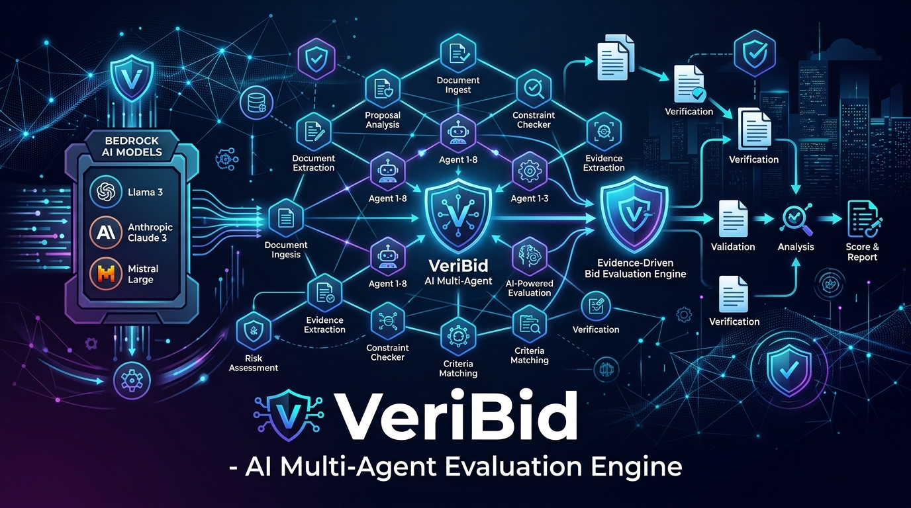
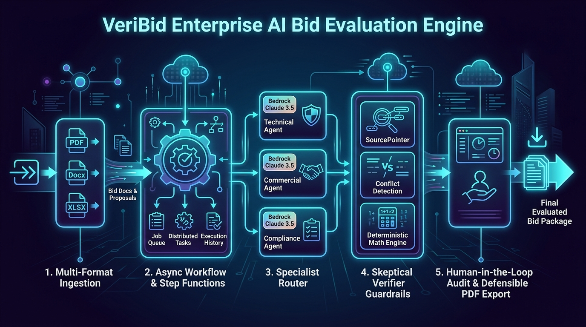
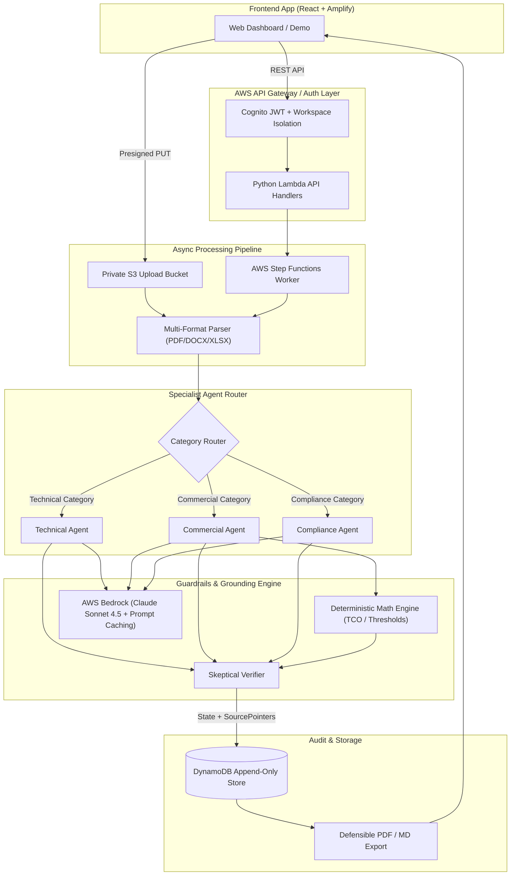

# VeriBid — Evidence-Driven Bid Evaluation Engine

<p align="center">
  
</p>

<p align="center">
  <strong>An AI Multi-Agent Engine for Defensible, Source-Grounded Procurement & RFP Evaluation</strong>
</p>

<p align="center">
  <a href="https://main.d2jw7e2fbiu6od.amplifyapp.com/"></a>
  <a href="https://main.d2jw7e2fbiu6od.amplifyapp.com/demo"></a>
  <a href="https://jzmjnr4tq4.execute-api.us-east-1.amazonaws.com/api/v1/health"></a>
</p>

<p align="center">
  
  
  
  
</p>

---

## 💡 Overview & Thesis

**VeriBid** is an evidence-driven bid evaluation engine designed to assist RFP (Request for Proposal) analysis while reducing unsupported AI assessments through source grounding and abstention. 

Unlike generic procurement platforms or ungrounded AI chatbots, VeriBid enforces strict **SourcePointer claim-grounding**, **Skeptical Verification**, and **Deterministic Mathematical Calculations**. AI agent specialists generate source-attributed suggestions, but **Human Reviewers own final binding decisions**.

```
  ┌────────────┐     ┌────────────┐     ┌────────────────┐     ┌──────────────────┐
  │   Upload   │ ──► │   Verify   │ ──► │  Human Review  │ ──► │ Defensible Export│
  └────────────┘     └────────────┘     └────────────────┘     └──────────────────┘
   Multi-Format        Skeptical          Append-Only Audit      Signed PDF & MD
   PDF/DOCX/XLSX       Verifier Agent     Decision Override      Matrix Reports
```

---

## 🧠 System & Agent Architecture

<p align="center">
  
</p>

### Multi-Agent Topology & Verification Workflow



---

## 🛡️ Non-Negotiable Invariants

VeriBid operates under strict architectural guardrails:

1. **SourcePointer Grounding**: Every factual AI assessment must map directly to a `SourcePointer` (document ID, page, section, or line numbers). Unresolvable evidence forces an `INSUFFICIENT_EVIDENCE` state.
2. **Deterministic Ownership**: LLMs perform semantic reasoning. Deterministic Python code (`Decimal` precision) owns numeric thresholds, formulas, SLAs, and Total Cost of Ownership (TCO) comparisons.
3. **Contradiction Management**: Material contradictions between proposal sections or buyer rubrics generate `CONFLICTING_EVIDENCE` with explicit `conflict_pairs`.
4. **Human Finality**: AI produces suggested states (`SATISFIED`, `PARTIALLY_SATISFIED`, `NOT_SATISFIED`). Human Reviewers hold exclusive authority for final states and scores. Overrides require mandatory justification and never erase original suggestions.
5. **Append-Only Auditability**: All evaluations, reviews, and overrides are immutably persisted as versioned audit trails.

---

## 🤖 Agent Logic & Verification Matrix

VeriBid delegates work across specialist agents and subjects output to a **Skeptical Verifier**:

| Agent / Component | Category | Responsibility & Behavior |
| :--- | :--- | :--- |
| **Router Agent** | Orchestration | Inspects extracted RFP requirements and routes them to specialist personas based on `RequirementCategory`. Never crosses vendor proposal boundaries. |
| **Technical Specialist** | `TECHNICAL` | Evaluates system SLA commitments, uptime percentages, infrastructure options, and technical criteria against buyer rubrics. |
| **Commercial Specialist** | `COMMERCIAL` | Extracts licensing, implementation fees, and annual support costs. Delegates mathematical totaling to the **Deterministic Engine**. |
| **Compliance Specialist** | `COMPLIANCE` | Checks regulatory requirements (e.g., EU Data Residency, ISO 27001, SOC 2). Flagged violations (e.g., US data processing when EU hosting is mandated) generate `conflict_pairs`. |
| **Deterministic Engine** | Tool Path | Provides exact mathematical threshold validation (`numeric_threshold_check`, `tco_limit_check`, `weighted_score`) in `Decimal` space. Overrides LLM logic. |
| **Skeptical Verifier** | Core Guardrail | Applies non-negotiable invariants: validates evidence presence, enforces abstain states on missing claims, flags conflicts, and validates typed Pydantic structures. |

---

## ⚡ Features & Capabilities

- 📄 **Multi-Format Ingestion**: Native text extraction for PDF, Microsoft Word (`.docx`), and Excel (`.xlsx`).
- 🔒 **Multi-Tenant Workspace Isolation**: Cognito JWT tokens carry immutable `custom:workspace_id` claims, enforcing strict data boundaries.
- ⚡ **Prompt Caching Telemetry**: Utilizes Bedrock Converse `cachePoint` blocks, capturing measurable token savings (`cache_read_input_tokens`, `cache_write_input_tokens`).
- 👥 **Role-Based Access Control**:
  - `TenantAdmin`: Full workspace control and evaluation management.
  - `SourcingLead`: Create, evaluate, and perform human overrides.
  - `Auditor`: Read-only access to evaluation matrix and audit exports.
- 📊 **Defensible Audit Export**: Generates self-contained Markdown and custom byte-compiled PDF audit packages preserving system recommendations vs. human overrides.

---

## 📁 Repository Structure

```
VeriBid/
├── backend/                        # Serverless Python Lambda Functions & Core Logic
│   ├── api.py                      # REST API Handlers, Cognito RBAC & DTO Boundary
│   ├── bedrock_adapter.py          # Bedrock Converse API Client & Prompt Caching Telemetry
│   ├── cognito_pre_token.py        # Cognito V2 Pre-Token Generation Lambda Trigger
│   ├── deterministic.py            # Authoritative Mathematical Engine (Decimal Precision)
│   ├── domain.py                   # Pydantic Domain Entities, Enums & SourcePointer Models
│   ├── ingestion.py                # PDF, DOCX & XLSX Parser Engine
│   ├── specialists.py              # Category Specialist Router (Technical, Commercial, Compliance)
│   ├── verifier.py                 # Skeptical Verifier Guardrails & Conflict Detection
│   └── worker.py                   # Step Functions Async Pipeline Worker
├── frontend/                       # React 19 + TypeScript Web Application
│   ├── src/                        # UI Components, Matrix Views & Amplify Auth Integration
│   └── vite.config.ts              # Vite & Vitest Configuration
├── infra/                          # AWS CDK v2 Infrastructure as Code (TypeScript)
│   └── lib/veribid-stack.ts        # Cloud Infrastructure Stack (Cognito, DynamoDB, S3, Step Functions)
├── scripts/                        # Repository Harness & Utility Tools
│   ├── check_agent_harness.py      # Standard-Library Agent Operating Contract Validator
│   └── run_cache_benchmark.py      # Bedrock Prompt Caching Performance Benchmark
├── docs/                           # Documentation & Visual Assets
│   ├── assets/                     # Architecture & Hero Visuals
│   ├── implementation/             # Execution Plans & Architecture Decision Records
│   └── harness/                    # Harness Adoption & Security Reports
└── README.md                       # Comprehensive Project Documentation
```

---

## 🚀 Quickstart & Developer Guide

### Prerequisites

- **Python**: `3.12+` or `3.13`
- **Node.js**: `20.x` or higher
- **AWS CLI** & **AWS CDK CLI**: Installed and configured (`aws configure`)

### 1. Local Environment Setup

```bash
# Clone the repository
git clone https://github.com/minhnhut273/veribid.git
cd VeriBid

# Set up Python virtual environment
python -m venv .venv
# Windows PowerShell:
.venv\Scripts\Activate.ps1
# Linux/macOS:
# source .venv/bin/activate

# Install backend dependencies
pip install -r backend/requirements.txt -r backend/requirements-dev.txt
```

### 2. Run Backend Tests & Harness Check

```bash
# Execute unit & integration tests
python -m pytest backend -v

# Verify local repository agent harness contract
python scripts/check_agent_harness.py
```

### 3. Run Frontend Local Development & Tests

```bash
cd frontend
npm install

# Run frontend unit tests
npx vitest --config vite.config.ts run

# Start Vite development server
npm run dev
```

### 4. Build CDK Infrastructure Stack

```bash
cd ../infra
npm install
npm run build
npx cdk synth
```

---

## 📡 API Reference (`/api/v1`)

| Endpoint | Method | Role | Description |
| :--- | :---: | :--- | :--- |
| `/api/v1/health` | `GET` | Public | System status and service health check. |
| `/api/v1/demo` | `GET` | Public | Read-only synthetic evaluation matrix fixture. |
| `/api/v1/evaluations` | `POST` | Write | Create a new evaluation scope. |
| `/api/v1/evaluations/{id}` | `GET` | Read | Fetch evaluation metadata and status. |
| `/api/v1/evaluations/{id}/documents` | `POST` | Write | Initialize S3 presigned PUT URL for upload. |
| `/api/v1/evaluations/{id}/requirements/extract` | `POST` | Write | Trigger async requirements extraction. |
| `/api/v1/evaluations/{id}/runs` | `POST` | Write | Start evaluation workflow run across vendors. |
| `/api/v1/evaluations/{id}/matrix` | `GET` | Read | Fetch full vendor evidence comparison matrix. |
| `/api/v1/evaluations/{id}/results/{res_id}/reviews` | `POST` | Write | Record human review action (`ACCEPT` / `OVERRIDE`). |
| `/api/v1/evaluations/{id}/exports` | `POST` | Write | Generate defensible Markdown or PDF export package. |

---

## 🔒 Security & Compliance

- **Security scope**: Workspace authorization, role checks, source grounding, and fail-closed typed-output behavior are covered in the implementation and test suite; a complete OWASP ASI certification claim is intentionally not made here.
- **Tenant Scope Enforcement**: Workspace isolation enforced at the API boundary before DynamoDB query execution.
- **Strict Presigned Upload Validation**: S3 uploads undergo mandatory byte size and MIME type verification before triggering worker parsers.
- **Evidence abstention**: The verifier abstains from score assignments when evidence claims fail strict validation; this is a control behavior, not a zero-hallucination guarantee.

---

## 📄 License & Attribution

No license file is currently declared in this repository. Add an explicit license before distributing the project as open source.
