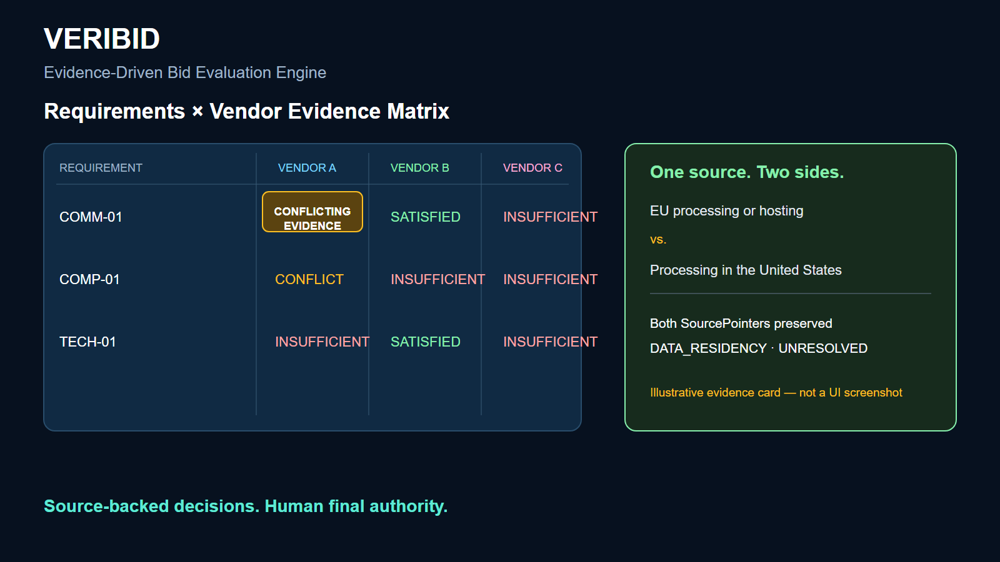
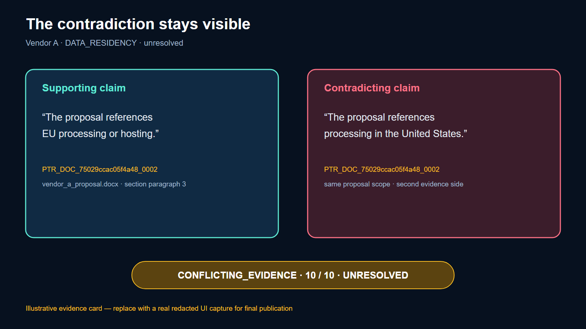
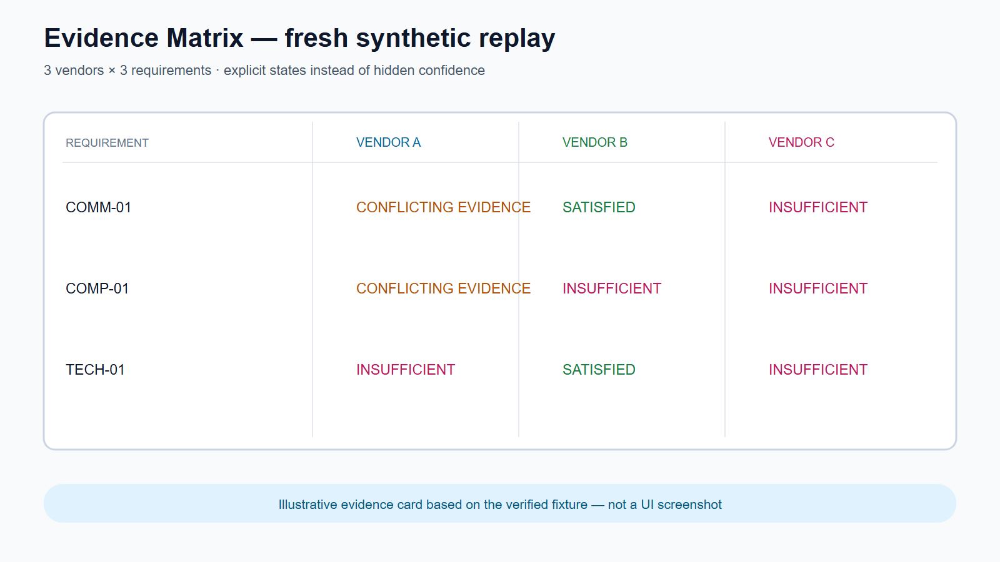
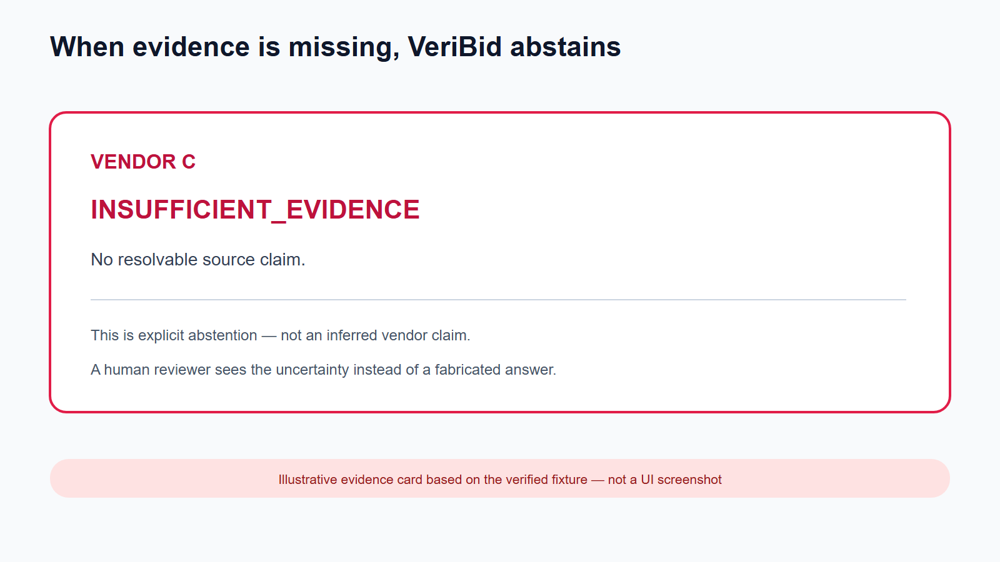
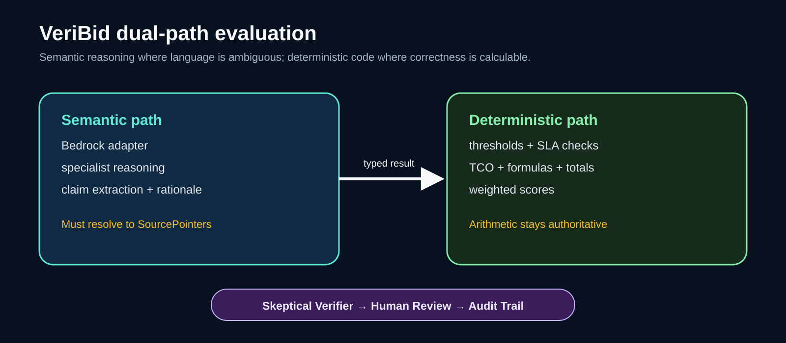
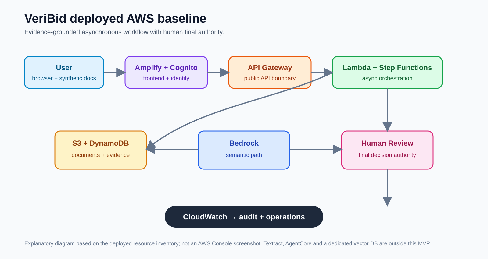
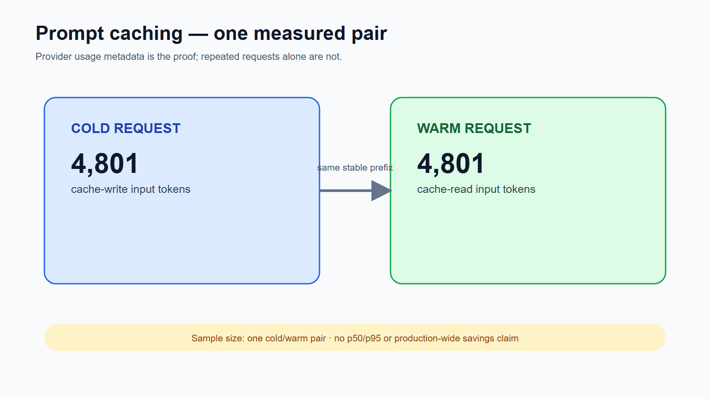
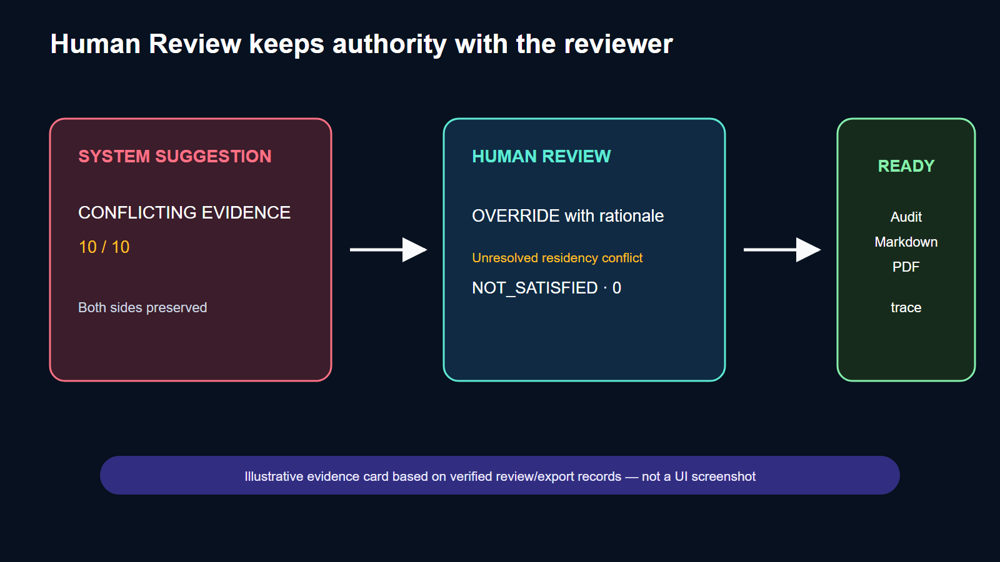

# VeriBid — From Scattered Proposals to Defensible Decisions

## Hero

**VeriBid is an evidence-driven bid evaluation engine for procurement and
compliance teams.**

It turns a proposal comparison into a traceable chain:

> Requirement → Evidence Claim → Source Pointer → Verification → Human Review → Audit Trail

VeriBid does not choose a winning vendor autonomously. It makes the reasoning
behind a review visible, challengeable, and exportable.

*Cover asset is a real application capture to be added before publication; the
current package does not fabricate a screenshot.*

## The contradiction that changes the workflow

Consider a mandatory data-residency requirement. One excerpt from Vendor A's
proposal supports EU processing or hosting. Another excerpt from the same
proposal references processing in the United States.

A normal summary can flatten those statements into one confident sentence.
VeriBid keeps both sides visible and labels the result
`CONFLICTING_EVIDENCE`, with the two claims, SourcePointers, document locator,
and unresolved conflict metadata preserved together.

*The final post should use the redacted authenticated UI capture for this
section.*

## Why bid evaluation breaks down

RFP requirements live in one document, vendor answers in several others, and
the final decision often ends up in a spreadsheet or a slide deck. That makes
it difficult to answer basic audit questions later:

- Which requirement was evaluated?
- Which vendor and proposal did the evidence belong to?
- Where exactly did the source say that?
- Was the result semantic reasoning, arithmetic, or a human decision?
- Did a reviewer accept the suggestion, override it, or leave it unresolved?

VeriBid treats those questions as product requirements, not after-the-fact
documentation.

## From proposals to an Evidence Matrix

The MVP ingests a buyer RFP, rubric, and vendor proposals; extracts atomic
requirements; preserves `vendor_id` and `proposal_id` scope; and presents a
matrix for review. Text-based DOCX, text-layer PDF, and XLSX evidence are in
scope for this MVP. Scanned or image-heavy PDF and Textract are outside the
current boundary.

The fresh production replay used three synthetic vendors and three
requirements, producing a 3 × 3 matrix. This is a controlled demonstration
fixture, not customer usage or a market benchmark.

## Conflict, abstention, and deterministic evidence

The most important result is sometimes a refusal to pretend certainty exists.

- **Vendor A:** both residency claims remain visible as
  `CONFLICTING_EVIDENCE`; the conflict is unresolved until a human reviews it.
- **Vendor C:** the result is `INSUFFICIENT_EVIDENCE — no resolvable source
  claim.` This is explicit abstention, not an inferred negative answer.
- **Vendor B:** a numeric threshold is rendered as
  `numeric_threshold_check · SATISFIED`, separately from semantic rationale.

## Dual-path evaluation architecture

VeriBid uses semantic reasoning where language understanding is required and
deterministic tools where correctness is calculable. Bedrock handles the
configured semantic path; deterministic Python/Lambda logic owns thresholds,
TCO, formulas, totals, and weighted calculations. The Skeptical Verifier
preserves contradictions, rejects unsupported claims, and fails closed on
schema/execution errors rather than relabeling them as missing evidence.

## Skeptical Verifier

Every user-visible factual AI assessment must resolve to a SourcePointer. The
verifier checks the typed result, evidence scope, conflict pairs, and canonical
state before persistence. A missing, ambiguous, non-responsive, or unresolvable
claim becomes `INSUFFICIENT_EVIDENCE`; a material contradiction becomes
`CONFLICTING_EVIDENCE` with both sides retained.

## AWS architecture

The deployed baseline uses Amplify, Cognito, API Gateway, Lambda, Step
Functions, S3, DynamoDB, Bedrock, and CloudWatch. The workflow is asynchronous:

1. upload and verify documents;
2. extract and scope evidence;
3. route semantic and deterministic evaluation;
4. persist verified results;
5. review and export a defensible report.

AgentCore, a dedicated vector database, and deployed Textract are not claimed
as part of this MVP.

## What the coding agent actually shipped

The development story is concrete rather than a generic “AI helped code” claim:

1. **Evidence-trace defect:** the agent inspected the live result path and
   extended the result detail and export renderer so both conflict sides carry
   claim IDs, excerpts, document metadata, SourcePointer IDs, locators, and
   verifier rationale.
2. **Deployment handoff:** local Docker-based CDK asset bundling was
   unavailable, so CI synthesized the production-context CDK assembly. The
   reviewed assembly was deployed with the dedicated `veribid-deploy`
   identity; CloudFormation reached `UPDATE_COMPLETE` and Amplify job 6
   reached `SUCCEED`.
3. **Production replay:** a fresh synthetic authenticated evaluation verified
   conflict, abstention, deterministic evidence, Human Review, append-only
   audit records, and READY Markdown/PDF export records.

The evidence for these episodes is kept in `docs/submission-proof/`; this page
does not claim a clean local Docker synth or customer usage.

## Prompt caching: one measured boundary

A controlled cold/warm benchmark recorded 4,801 cache-write input tokens on the
cold request and 4,801 cache-read input tokens on the warm request, based on
provider usage metadata. The sample size is one pair. VeriBid does not claim
p50, p95, a production-wide hit rate, latency improvement, or guaranteed cost
savings from this result.

## Human review and defensible export

The system suggestion is not the final decision. In the fresh replay, ACCEPT
succeeded; an empty-rationale OVERRIDE remained disabled; and a rationale-backed
OVERRIDE succeeded with final state `NOT_SATISFIED`, score `0`, while retaining
the original `CONFLICTING EVIDENCE · 10 / 10` suggestion. Separate audit events
and review records preserve the history.

Markdown and PDF export records reached `READY`. The Markdown export retained
the supporting and contradicting conflict trace, claim IDs, and SourcePointer
data. The browser did not expose a local downloaded file, so this package does
not claim one.

## Commercial path

The initial customer is a procurement, compliance, or security-review team in
an enterprise or regulated mid-market organization that compares several
proposals against a common RFP and must defend the decision later.

The commercial value is not “an AI picks the winner.” It is a review system
that reduces evidence-search friction, makes uncertainty visible, and gives a
team a defensible artifact for approval and audit. A natural product path is a
workspace-based SaaS offering with organization-level access control, document
retention policy, review queues, export, and integrations added only after the
evidence-grounded MVP is measured with real users.

## MVP boundaries

VeriBid is intentionally bounded:

- no autonomous vendor award;
- no claim that one synthetic replay represents customer performance;
- no scanned-PDF/Textract support claim;
- no p50/p95 or production-wide prompt-cache claim;
- no AgentCore or dedicated vector-database claim;
- human review remains the final authority.

## Try it

- **Live application:** https://main.d2jw7e2fbiu6od.amplifyapp.com/
- **Public demo:** https://main.d2jw7e2fbiu6od.amplifyapp.com/demo
- **Repository:** https://github.com/minhnhut273/veribid

The published version should include the redacted real UI captures listed in
`asset-manifest.md`, confirm the project is original and not previously
published, and then be reviewed by a human before the final Builder Center
Publish action.
